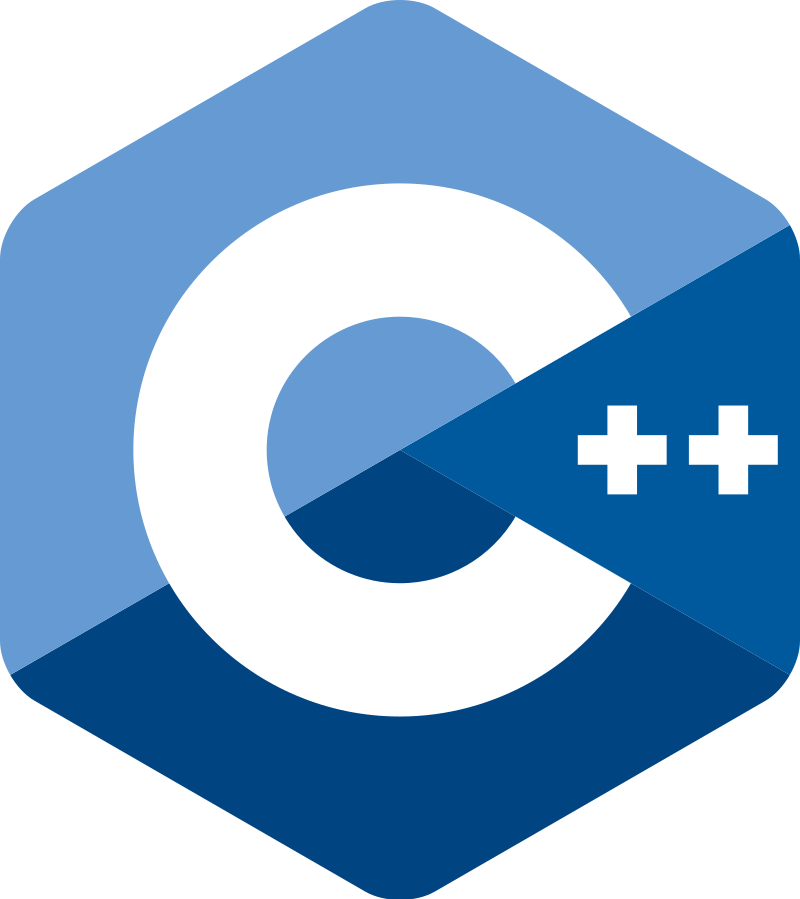
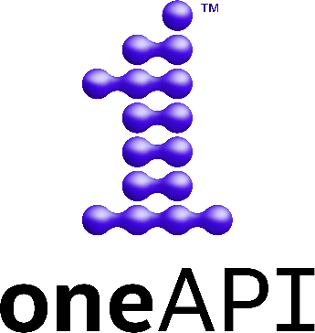

# Antônio Drumond Cota de Sousa

## About me
- Undergraduate researcher at [PUC Minas](https://icei.pucminas.br/)
- Interested in Operating Systems, Computer Architecture and HPC
- Currently working in [NARVI](https://github.com/cart-pucminas/narvi) and studying [OneAPI](https://oneapi.io/)

## Skills
#### My top languages by skill:

#### Other languages and technologies

## Contact me here:
+ **Email:** antonio.drumondcs@gmail.com
